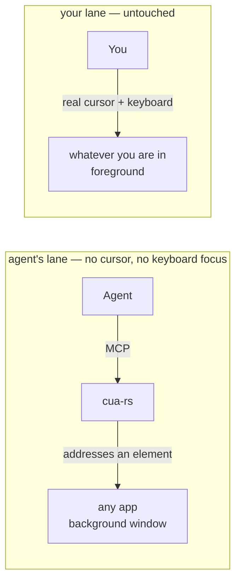
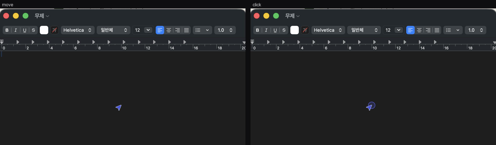

# cua-rs

**Your Mac, driven by an agent. Your cursor stays yours.**

[](https://github.com/maestrojeong/cua-rs-mcp/actions/workflows/ci.yml)
[](https://github.com/maestrojeong/cua-rs-mcp/releases)
[](LICENSE)


A macOS computer-use MCP server that drives native apps through the
**Accessibility API** — addressing a UI element instead of moving a pointer to a
coordinate. Nothing moves your cursor, takes your keyboard focus, or switches
your Space, so an agent can work in a background window while you keep typing in
another. One Rust binary.



There is no arrow between the lanes, and that is the whole product.

### Three ways to drive a Mac

"Synthesize input or use accessibility" is the wrong axis, because the
interesting middle exists: you can synthesize an event and still deliver it to
one process instead of the shared stream. What separates the approaches is not
the API, it is **what they are willing to take from you**.

| | shared input | per-process, plus focus | cua-rs |
|---|:--|:--|:--|
| how a click travels | cursor warp, then the global HID queue | synthesized event routed to one pid | AX action; a pid-routed event where no AX action, or on request no element, exists |
| the pointer | moves | stays | stays |
| keyboard focus | goes wherever the click lands | target is activated and held | unchanged |
| your Space | can switch | can switch | never |
| an occluded window | blank or stale capture | raised first, so never occluded | captured where it is |
| you, working meanwhile | input collides | you lose focus | works |

The middle column is a real design, not a strawman — routing per pid is what
cua-rs does too for controls that expose no AX action. The difference is the
second half: it activates the target and keeps it frontmost, which is a
reasonable trade when a human is not sitting there, and the wrong one when they
are.

[trycua/cua](https://github.com/trycua/cua/tree/main/libs/cua-driver)'s driver
does not pick one: it ships both contracts side by side. Its `click_at_xy` routes
a SkyLight event to a pid — the same recipe cua-rs ports — while
`click_at_xy_desktop` posts to the global HID tap so the OS delivers it to
whatever owns the pixel, "the foreground, vision-driven model that complements
the background contract" in its own words. Which transport you get depends on how
the agent found the target: a tree gives you a pid, a screenshot gives you a
pixel.

cua-rs implements only the background half — and it turns out the background half
reaches further than "accessibility only" suggests. The pid route needs a window
and a point, not an element, so `click_in_window` can be aimed at a bare pixel of
a canvas without a cursor warp. It just cannot tell you whether anything was
there, which is why it is a separate opt-in tool rather than a fallback.

So cua-rs is best described by what it will not do. There is no flag that warps
the pointer, posts to the shared keyboard stream, or raises a window: those paths
are absent, and [DESIGN.md](DESIGN.md) covers what that costs — no chords, no
drag, and no verification once you aim at a pixel yourself.

## Install

```bash
curl -fsSL https://raw.githubusercontent.com/maestrojeong/cua-rs-mcp/main/install.sh | sh
cua-rs --help
```

Pin a release with `CUA_VERSION=v0.4.2`, or build from source with
`cargo install --git https://github.com/maestrojeong/cua-rs-mcp cua-mcp`.

> Downloading the binary by hand from the Releases page? Clear the quarantine
> flag or it hangs instead of erroring: `xattr -d com.apple.quarantine ./cua-rs`.
> The installer above does this for you.

## Grant permissions

Two grants, and **they attach to the process that launches `cua-rs`, not to
`cua-rs` itself** — macOS credits the responsible process, so a grant given to
iTerm does not carry to Claude Desktop, Cursor, or Codex CLI. The upside: a
`cua-rs` upgrade never costs a re-approval, because the grant was never on this
binary.

| Grant | Needed for | Without it |
|---|:--|:--|
| Accessibility | reading UI structure, every action | nothing works |
| Screen Recording | screenshots, and last-moment window validation for process-routed clicks | tree and AX actions still work; no images |

```bash
cua-rs permissions      # never prompts
# accessibility:    true
# screen_recording: true
```

System Settings → Privacy & Security → Accessibility (then Screen Recording),
add the **host** app, restart it.

## Connect

```json
{ "mcpServers": { "cua": { "command": "cua-rs" } } }
```

Or Streamable HTTP for a client that attaches to an already-running server:

```bash
cua-rs 9331     # http://127.0.0.1:9331/mcp  ·  /health
```

Loopback only, always. It exposes full desktop control and has no authentication
of its own, so a reachable port would hand your machine to the network.

## Use

`get_app_state` first, always: it walks one window, captures it in the same
moment, and numbers everything actionable. Those numbers are what actions take.

```text
Notes (pid 41277)  snapshot_id=1
window: Groceries

AXWindow "Groceries"
  AXToolbar
    [3] AXButton "New Note"
    [7] AXTextField:SearchField "Search" (editable)
  [12] AXOutline "Notes"
    [13] AXRow "Groceries" (selected)
  [21] AXTextArea = "milk\neggs" (editable, focused)
```

```json
{ "app": "Notes", "element_token": "1-3-AXButton" }
```

Lines with `[N]` are targetable; the rest is context, so a model does not try to
press a scroll area. `element_token` bundles the snapshot, index and role, which
makes acting on a stale handle an error instead of a mis-click — the one failure
mode a retry cannot fix and you cannot see. `x`/`y` also works, resolved against
the snapshot's own geometry, but an index names an element while a point only
names a place.

| Tool | |
|---|:--|
| `get_app_state` | **call first** — tree + screenshot from one snapshot |
| `find` · `wait_for` | search the snapshot; poll until text appears or goes |
| `click` | `AXPress` → `AXPick` → `AXConfirm`, else a pid-routed event |
| `click_in_window` | last resort: a bare point, no element, nothing verified |
| `set_value` · `type_text` · `select_text` | write, append, select a substring |
| `press_key` | Return / Escape / arrows via AX; chords are refused |
| `scroll` · `perform_secondary_action` | page a scroll area; any AX verb |
| `list_apps` · `check_permissions` | running apps; grant status |

Actions re-read the window and return a delta by default, so acting and looking
cost one round trip instead of two. **Read it as a textual delta, not as proof:**
lines are compared without index or indentation — which is what stops an app that
regroups its own subtrees from reporting hundreds of lines as change — so two
identically-worded rows are interchangeable and a selection moving between them
shows as nothing. It is reliable for structure arriving or leaving, like a menu
opening. To know one element's state, read that element.

For a dense app, `skeleton: true` summarizes big subtrees, then
`scope_element_id` spends the whole budget inside one of them.

## Limits

Honest ones, not a roadmap.

| | |
|---|:--|
| buttons, menus, tabs, rows, text fields | yes |
| Electron apps | yes — the tree builds lazily, so read twice |
| Return, Escape, stepper arrows | yes, as AX verbs |
| arbitrary chords (`⌘⇧P`), drag | **no** — no AX verb exists |
| canvas apps, games | clickable, but you supply the coordinate and the confidence |
| terminals | reading yes; typing no — they ignore AX writes |

`set_value` replaces, `type_text` appends, and an app that only reacts to real
key events will ignore both. Controls with no AX action at all get a mouse event
routed to the target process by window id, reported as `delivery: pid`; if that
is unavailable the action fails rather than touching your pointer.

For a surface that publishes no elements at all, `click_in_window` takes a
window-local point in points — a screenshot pixel divided by the scale
`get_app_state` reports — and posts the click through the same pid route. It
refuses a window id your last read did not produce, and an offset outside the
window's live frame. What it will not do is confirm: there is no element to read
back, so the result says `delivery: pid (no element)` and means the event was
delivered to that pixel, not that anything was hit.

## The drawn cursor

The AX path leaves nothing on screen, which is the point — and also means you
cannot see the agent working. `cua-overlay` is a separate binary that draws an
arrow where an action landed: click-through, never focused, never your real
cursor. It is ordered just above the target window, and hides itself whenever
that app is not frontmost, so it cannot end up floating over your work.

<p align="center"></p>

`cua-rs` spawns it if it sits next to the binary. **The prebuilt release ships
`cua-rs` alone**, so build the workspace to get both.

## Development

```bash
cargo build --workspace
cargo test --workspace          # 98 tests, no permissions needed
cargo clippy --workspace --all-targets -- -D warnings
```

```text
cua-ax        safe AXUIElement wrapper + budgeted tree walker
cua-capture   window discovery + crash-isolated per-window PNG
cua-core      app resolution, one native worker thread, snapshots
cua-hid       process-routed input — the only crate that synthesizes events
cua-mcp       the server, binary `cua-rs`
cua-overlay   the drawn cursor
```

Two constraints worth knowing before touching it: every native call runs on one
thread, because `AXUIElement` handles are honestly `!Send`; and every tree walk
is budgeted, because an AX tree can be unbounded and is not guaranteed acyclic.
[DESIGN.md](DESIGN.md) has the reasoning, the measurements, and the known weak
spots.

`cua-ax` is publishable on its own, and is the piece the Rust ecosystem is
missing — [`accessibility-sys`](https://crates.io/crates/accessibility-sys) has
not shipped an API change since March 2025, and
[`objc2-application-services`](https://crates.io/crates/objc2-application-services)
gives raw bindings with no safe layer.

## Prior art

- [**trycua/cua**](https://github.com/trycua/cua/tree/main/libs/cua-driver) —
  larger, cross-platform, further along, and a superset of the approaches above.
  Its docs are the best free writing on this problem domain.
- [**lahfir/agent-desktop**](https://github.com/lahfir/agent-desktop) — Rust AX
  engine, CLI rather than MCP.
- [**minghinmatthewlam/computer-use-mcp**](https://github.com/minghinmatthewlam/computer-use-mcp) —
  same positioning, in Swift.

Chromium content degrades under any AX-only tool; the intended answer is to hand
the web to [browser-rs](https://github.com/maestrojeong/browser-rs-mcp) over CDP
rather than fight `AXManualAccessibility`.

| | |
|---|:--|
| [browser-rs](https://github.com/maestrojeong/browser-rs-mcp) | web, over CDP |
| [bash-rs](https://github.com/maestrojeong/bash-rs-mcp) | shell, backgrounded |
| **cua-rs** | native macOS apps, over AX |

## License

Apache-2.0
