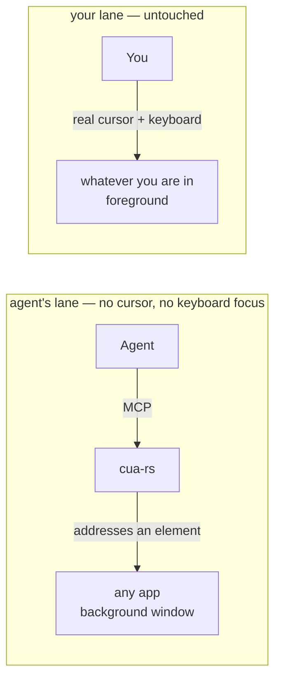

# cua-rs

**Your Mac, driven by an agent. Your cursor stays yours.**

[](https://github.com/maestrojeong/cua-rs-mcp/actions/workflows/ci.yml)
[](https://github.com/maestrojeong/cua-rs-mcp/releases)
[](LICENSE)


A macOS computer-use MCP server that drives native apps through the
**Accessibility API** — addressing a UI element instead of moving a pointer to a
coordinate. Nothing moves your cursor, takes your keyboard focus, or switches
your Space, so an agent can work in a background window while you keep typing in
another. One Rust binary.



There is no arrow between the lanes, and that is the whole product. What it
will not do is the point: no flag warps the pointer, posts to the shared
keyboard stream, or raises a window. [DESIGN.md](DESIGN.md) covers what that
costs.

## Install

```bash
curl -fsSL https://raw.githubusercontent.com/maestrojeong/cua-rs-mcp/main/install.sh | sh
cua-rs --help
```

Pin a release with `CUA_VERSION=v0.4.2`, or build from source with
`cargo install --git https://github.com/maestrojeong/cua-rs-mcp cua-mcp`.

> Downloading the binary by hand from the Releases page? Clear the quarantine
> flag or it hangs instead of erroring: `xattr -d com.apple.quarantine ./cua-rs`.
> The installer above does this for you.

## Grant permissions

Two grants, and **they attach to the process that launches `cua-rs`, not to
`cua-rs` itself** — so a grant given to iTerm does not carry to Claude Desktop,
Cursor, or Codex CLI, and a `cua-rs` upgrade never costs a re-approval.

| Grant | Needed for | Without it |
|---|:--|:--|
| Accessibility | reading UI structure, every action | nothing works |
| Screen Recording | screenshots, last-moment window validation for process-routed clicks | tree and AX actions still work; no images |

```bash
cua-rs permissions      # never prompts
```

System Settings → Privacy & Security → Accessibility (then Screen Recording),
add the **host** app, restart it.

## Connect

```json
{ "mcpServers": { "cua": { "command": "cua-rs" } } }
```

Or Streamable HTTP for a client that attaches to an already-running server:

```bash
cua-rs 9331     # http://127.0.0.1:9331/mcp  ·  /health
```

Loopback only, always. It exposes full desktop control and has no authentication
of its own.

## Use

`get_app_state` first, always: it walks one window, captures it in the same
moment, and numbers everything actionable. Those numbers are what actions take.

```text
Notes (pid 41277)  snapshot_id=1
  AXWindow "Groceries"
    [3] AXButton "New Note"
    [7] AXTextField:SearchField "Search" (editable)
  [21] AXTextArea = "milk\neggs" (editable, focused)
```

```json
{ "app": "Notes", "element_token": "1-3-AXButton" }
```

Lines with `[N]` are targetable; the rest is context. `element_token` bundles
the snapshot, index and role, so acting on a stale handle errors instead of
mis-clicking. `x`/`y` also works, resolved against the snapshot's geometry.

Pass `snapshot_id` whenever you act on a **coordinate** rather than an element.
A stale index can be caught by the role it used to have; a stale pixel cannot be
caught by anything — it is still inside the window and still covering something,
just not what you looked at. `snapshot_id` is the only guard that catches it,
and `click`, `click_in_window`, `drag` and `hover` all honour it.

| Tool | |
|---|:--|
| `get_app_state` | **call first** — tree + screenshot from one snapshot |
| `find` · `wait_for` | search the snapshot; poll until text appears or goes |
| `click` | a pid-routed event; `button` (left/right/middle), `modifiers` (`cmd+shift`, …), `count` |
| `drag` · `hover` | press–move–release between two ends; a `mouseMoved` that reveals hover-only UI |
| — | every action returns what it did — verb, target, `delivery`, and a tree diff by default. Nothing is fire-and-forget |
| `click_in_window` | last resort: a bare point, no element, nothing verified |
| `set_value` · `type_text` · `select_text` | write, append, select a substring — a single AX call. `type_text` takes `mechanism: "keystrokes"` for targets that ignore `AXValue` |
| `press_key` | any key or chord (`⌘⇧P`, `ctrl+alt+delete`, …), pid-routed |
| `scroll` · `perform_secondary_action` | pages through AX, or a wheel event where there is no AX verb; any AX verb |
| `list_apps` · `check_permissions` | running apps; grant status |

Actions re-read the window and return a delta by default, so acting and looking
cost one round trip instead of two. Read it as a textual delta, not as proof —
to know one element's state, read that element. For a dense app, `skeleton: true`
summarizes big subtrees, then `scope_element_id` spends the whole budget inside
one of them.

## Limits

| | |
|---|:--|
| buttons, menus, tabs, rows, text fields, Electron apps | yes (Electron: the tree builds lazily, so read twice) |
| any key or chord | yes, pid-routed, with an honest `focus:` verdict on where it landed |
| right-click, middle-click, ⌘/⇧/⌥/⌃-click | yes, pid-routed — **built, not yet verified on a real app** |
| drag | yes: a real down, interpolated moves and an up, both ends in one window — **built, not yet verified on a real drag source** |
| hover | a synthesized `mouseMoved` — **built, unproven**, and your cursor does not move, so an app that polls the *real* pointer position instead of reading the event will not react at all |
| scrolling something with no AX scroll verb (Electron list, canvas, web content) | yes, a wheel event at the element's point — **built, not yet verified** |
| canvas apps, games | clickable and draggable, but you supply the coordinate and the confidence |
| terminals | reading yes; typing yes with `type_text mechanism="keystrokes"`, which sends real per-pid key events. The default `AXValue` write is still ignored by terminals, and the keystroke path is measured on TextEdit, not yet on a terminal |

"Built, not yet verified" means the events are constructed and delivered on the
same pid route `click` uses, the logic behind them is unit-tested without any
grant, and nobody has yet watched a real app accept one. Distrust `hover` and
the wheel scroll hardest: they rest entirely on reasoning by analogy with the
click path. [DESIGN.md](DESIGN.md) §11 lists what is owed and names the
experiment that would settle each one.

`set_value` replaces and `type_text` appends via one atomic `AXValue` write; an
app that only reacts to real key events ignores both, which is what
`mechanism: "keystrokes"` is for — explicit rather than automatic, because a
write cua-rs cannot tell was ignored is not a signal to start typing. `click`
and `press_key` never attempt an AX action at all — every event is routed to the
target process by pid, reported as `delivery: pid`, and fails rather than
touching your pointer if that tier is unavailable.

Anything that sends real keys is addressed to the *process*, so it arrives at
whatever that process's first responder is. Those results carry
`focus: verified | unverified | mismatched`, compared against the app's own
focused element: `mismatched` means the keys most likely reached a sibling of
the element you named (never another app — the event never leaves the target
process), and `unverified` means the app published nothing to check against.
Delivery happens anyway in both cases; `CUA_KEY_STRICT_FOCUS=1` refuses on
`mismatched` instead. Clicking a target before typing into it is the reliable
way to get `verified` — a window that has never been clicked can be frontmost
and still have no key window at all.

## The drawn cursor

The AX path leaves nothing on screen — which also means you cannot see the agent
working. `cua-overlay` is a separate binary that draws a click-through arrow where
an action landed, never focused, never your real cursor. `cua-rs` spawns it if it
sits next to the binary; **the prebuilt release ships `cua-rs` alone**, so build
the workspace to get both.

<p align="center"></p>

## Development

```bash
cargo build --workspace
cargo test --workspace          # no permissions needed
cargo clippy --workspace --all-targets -- -D warnings

# read-back tests for the keyboard path: needs an Accessibility grant,
# a GUI session and TextEdit, so they are #[ignore]d by default
cargo test -p cua-core --test live_keyboard -- --ignored --test-threads=1
```

```text
cua-ax        safe AXUIElement wrapper + budgeted tree walker
cua-capture   window discovery + crash-isolated per-window PNG
cua-core      app resolution, one native worker thread, snapshots
cua-hid       process-routed input — the only crate that synthesizes events
cua-mcp       the server, binary `cua-rs`
cua-overlay   the drawn cursor
```

Two constraints worth knowing before touching it: every native call runs on one
thread, because `AXUIElement` handles are honestly `!Send`; and every tree walk
is budgeted, because an AX tree can be unbounded and is not guaranteed acyclic.
[DESIGN.md](DESIGN.md) has the reasoning, the measurements, and the known weak
spots.

## Prior art

- [**trycua/cua**](https://github.com/trycua/cua/tree/main/libs/cua-driver) — larger, cross-platform, further along; its docs are the best free writing on this domain.
- [**lahfir/agent-desktop**](https://github.com/lahfir/agent-desktop) — Rust AX engine, CLI rather than MCP.
- [**minghinmatthewlam/computer-use-mcp**](https://github.com/minghinmatthewlam/computer-use-mcp) — same positioning, in Swift.

Chromium content degrades under any AX-only tool; hand the web to
[browser-rs](https://github.com/maestrojeong/browser-rs-mcp) over CDP instead.

## License

Apache-2.0
