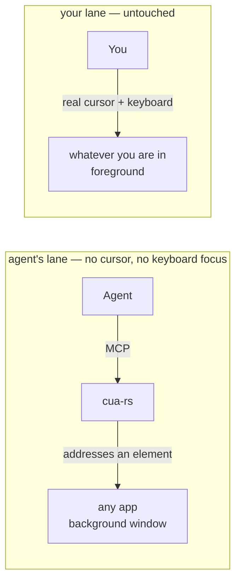

# cua-rs

**Your Mac, driven by an agent. Your cursor stays yours.**

[](https://github.com/maestrojeong/cua-rs-mcp/actions/workflows/ci.yml)
[](https://github.com/maestrojeong/cua-rs-mcp/releases)
[](LICENSE)


A macOS computer-use MCP server that drives native apps through the
**Accessibility API** — addressing a UI element instead of moving a pointer to a
coordinate. Nothing moves your cursor, takes your keyboard focus, or switches
your Space, so an agent can work in a background window while you keep typing in
another. One Rust binary.



There is no arrow between the lanes, and that is the whole product. What it
will not do is the point: no flag warps the pointer, posts to the shared
keyboard stream, or raises a window. [DESIGN.md](DESIGN.md) covers what that
costs.

## Install

```bash
curl -fsSL https://raw.githubusercontent.com/maestrojeong/cua-rs-mcp/main/install.sh | sh
cua-rs --help
```

Pin a release with `CUA_VERSION=v0.4.2`, or build from source with
`cargo install --git https://github.com/maestrojeong/cua-rs-mcp cua-mcp`.

> Downloading the binary by hand from the Releases page? Clear the quarantine
> flag or it hangs instead of erroring: `xattr -d com.apple.quarantine ./cua-rs`.
> The installer above does this for you.

## Grant permissions

Two grants, and **they attach to the process that launches `cua-rs`, not to
`cua-rs` itself** — so a grant given to iTerm does not carry to Claude Desktop,
Cursor, or Codex CLI, and a `cua-rs` upgrade never costs a re-approval.

| Grant | Needed for | Without it |
|---|:--|:--|
| Accessibility | reading UI structure, every action | nothing works |
| Screen Recording | screenshots, last-moment window validation for process-routed clicks | tree and AX actions still work; no images |

```bash
cua-rs permissions      # never prompts
```

System Settings → Privacy & Security → Accessibility (then Screen Recording),
add the **host** app, restart it.

Note that cua-rs refuses to *act* on System Settings itself, along with Keychain
Access and password managers — see [Safety](#safety). Reading them still works.

## Connect

```json
{ "mcpServers": { "cua": { "command": "cua-rs" } } }
```

Or Streamable HTTP for a client that attaches to an already-running server:

```bash
cua-rs 9331     # http://127.0.0.1:9331/mcp  ·  /health
```

Loopback only, always — and loopback is not an authorization boundary, so `/mcp`
also requires a bearer token. Set `CUA_HTTP_TOKEN` to pin one, or let the server
generate one and print it on stderr at startup:

```text
INFO cua_mcp: generated a bearer token for this run. Clients must send
              `Authorization: Bearer 9f3c…` to /mcp. Set CUA_HTTP_TOKEN to pin your own.
```

`/health` stays open, so a supervisor can probe a server it has no credential
for. stdio mode needs no token: the client already owns the process.

## Safety

Six gates. Each refusal names what to pass or change, so an agent can resolve
it in one round trip. [DESIGN.md §7a](DESIGN.md) has the reasoning.

| | default | how to change it |
|---|:--|:--|
| **Scope this run to the apps you actually want driven.** Unset, every app is actionable. Set, acting on anything else is refused — reading still works. Bundle identifiers, comma-separated; `list_apps` prints them. Setting it to an *empty* value refuses everything rather than reopening the scope, so a typo cannot quietly disarm it. | unscoped | `CUA_ALLOWED_APPS=com.kakao.KakaoTalkMac,com.apple.TextEdit` |
| **Credential and security apps are never driven.** Keychain Access, the Passwords app, 1Password / Bitwarden / LastPass / Dashlane / KeePass and friends, System Settings, login and unlock prompts. Matched on bundle identifier, not display name. | on | `CUA_ALLOW_FORBIDDEN_TARGETS=1` |
| **Reading them is still allowed** — `get_app_state`, `find`, `list_apps` — because a blocked app you cannot even look at is one you cannot explain. The screenshot is withheld, though: pixels reproduce the secret rather than describing it. | on | same flag |
| **Destructive controls need confirming.** A target whose label reads as Delete / Remove / Erase / Reset / Move to Trash / Don't Save / 삭제 / 제거 / 초기화 / 나가기 is refused, as is `cmd+delete` and a bare `delete` outside a text field. | on | pass `confirm_destructive: true` on that call |
| **…and Return is judged by the button it will actually press.** Inside a dialog, `press_key return` activates the *default* button whatever you aimed at, so the gate resolves `AXDefaultButton` and classifies that. Aiming Return at an alert's Cancel used to press Delete unrefused. | on | same parameter |
| **…and so does a terse button under a destructive question.** "OK" in a sheet asking *Delete 4 items?*, 확인 under *4개 항목을 삭제할까요?* — the verb is in the alert, not on the button. Only a sheet or dialog counts as the question; an ordinary window's content never does, so a mail thread about deleting nothing changes. **Cancel, No, Keep, Save, 취소, 저장 are never refused** — an answer that names its own harmlessness is judged by itself, not by the question, so backing out of a destructive dialog (or saving instead of discarding) never needs confirming. | on | same parameter |
| **Nothing is delivered to a locked screen** or one running its screen saver. Reads continue. | on | — |
| **Yield to the human.** When enabled, cua-rs stops acting on an app while the human is using it, rather than fighting them for the window. Uses a listen-only event tap that returns every event unchanged — it reads the input stream and never writes to it. | **off** | `CUA_YIELD_TO_HUMAN=1`, `CUA_YIELD_IDLE_MS` (default 3000) |

The label classifier deliberately over-reports: a false positive costs one extra
call, a false negative costs a deleted conversation. If a refusal looks wrong,
confirming is the right answer.

**`CUA_ALLOWED_APPS` is the recommended posture**, and the one gate that is a
scope rather than a heuristic. The other five guess at what is dangerous; this
one asks you what the run is *for*. A blocklist fails open on every app nobody
thought to list — a scope cannot. It is off by default only so an upgrade does
not break a working install, and only the human who launches the process can set
it: there is deliberately no tool to widen it from inside, because a boundary the
agent can move is not a boundary.

## Use

`get_app_state` first, always: it walks one window, captures it in the same
moment, and numbers everything actionable. Those numbers are what actions take.

```text
Notes (pid 41277)  snapshot_id=1
  AXWindow "Groceries"
    [3] AXButton "New Note"
    [7] AXTextField:SearchField "Search" (editable)
  [21] AXTextArea = "milk\neggs" (editable, focused)
```

```json
{ "app": "Notes", "element_token": "1-3-AXButton" }
```

Lines with `[N]` are targetable; the rest is context. `element_token` bundles
the snapshot, index and role, so acting on a stale handle errors instead of
mis-clicking. `x`/`y` also works, resolved against the snapshot's geometry.

Pass `snapshot_id` whenever you act on a **coordinate** rather than an element.
A stale index can be caught by the role it used to have; a stale pixel cannot be
caught by anything — it is still inside the window and still covering something,
just not what you looked at. `snapshot_id` is the only guard that catches it,
and `click`, `click_in_window`, `drag` and `hover` all honour it.

| Tool | |
|---|:--|
| `get_app_state` | **call first** — tree + screenshot from one snapshot |
| `find` · `wait_for` | search the snapshot; poll until text appears or goes |
| `click` | a pid-routed event, no `AXPress`/`AXPick`/`AXConfirm` attempt; `button` (left/right/middle), `modifiers` (`cmd+shift`, …), `count`, `confirm_destructive` for a Delete-shaped target |
| `drag` · `hover` | press–move–release between two ends; a `mouseMoved` that reveals hover-only UI |
| — | every action returns what it did — verb, target, `delivery`, and a tree diff by default. Nothing is fire-and-forget |
| `click_in_window` | a bare point, no element, nothing verified — last resort on a canvas, and the only addressing a pop-up window has |
| `set_value` · `type_text` · `select_text` | write, append, select a substring — a single AX call. `type_text` takes `mechanism: "keystrokes"` for targets that ignore `AXValue` |
| `press_key` | any key or chord (`⌘⇧P`, `ctrl+alt+delete`, …), pid-routed |
| `scroll` · `perform_secondary_action` | pages through AX, or a wheel event where there is no AX verb; any AX verb |
| `list_apps` · `check_permissions` | running apps; grant status |

Actions re-read the window and return a delta by default, so acting and looking
cost one round trip instead of two. Read it as a textual delta, not as proof —
to know one element's state, read that element. For a dense app, `skeleton: true`
summarizes big subtrees, then `scope_element_id` spends the whole budget inside
one of them.

## Limits

| | |
|---|:--|
| buttons, menus, tabs, rows, text fields, Electron apps | yes (Electron: the tree builds lazily, so read twice) |
| **seeing a pop-up menu a click opened** | yes. It is a separate window with no accessibility representation, so it is never in the tree; `get_app_state` and every action's own result list it — id, level, frame, and whether it just appeared — and the window screenshot already contains it, because macOS photographs a window together with the pop-up attached to it |
| **picking a row in that menu** | **only by its keyboard shortcut.** `press_key` with the item's own key equivalent (⌘I, ⌘T, ⌥⌘,) is measured to activate it. A `click_in_window` coordinate is delivered and *dismisses* the menu without selecting anything — a menu tracks the real pointer, and cua-rs does not move the real pointer. Reading the item labels and their shortcuts off the screenshot is yours; cua-rs does no OCR |
| any key or chord | yes, pid-routed, with an honest `focus:` verdict on where it landed. A bare character key carries the character as well as the keycode, so a non-Latin input source cannot substitute a different letter — `press_key x` under a Korean source delivered `ㅌ` before this |
| right-click, middle-click, ⌘/⇧/⌥/⌃-click | yes, pid-routed. **Measured:** a right-click opened a context menu on TextEdit's text view; a ⇧-click extended a selection an unmodified click leaves empty |
| drag | yes: a real down, interpolated moves and an up, both ends in one window. **Measured:** dragging across TextEdit selected exactly the text spanned |
| hover | a synthesized `mouseMoved` — **built, unproven**, and your cursor does not move, so an app that polls the *real* pointer position instead of reading the event will not react at all |
| scrolling something with no AX scroll verb (Electron list, canvas, web content) | **no, and it is refused rather than faked.** The wheel event is delivered and scrolls nothing — measured against the window's pixels on a native `AXScrollArea` and on Chromium web content, in both pixel and line units — so `scroll` errors and the message sends you to `press_key` with `pagedown` / `pageup` / `down` / `up`, which does reach the same scroller. `CUA_WHEEL_SCROLL=1` delivers it anyway, for re-running the experiment. [DESIGN.md](DESIGN.md) §11 has the numbers |
| canvas apps, games | clickable and draggable, but you supply the coordinate and the confidence |
| terminals | reading yes; typing yes with `type_text mechanism="keystrokes"`, which sends real per-pid key events. The default `AXValue` write is still ignored by terminals, and the keystroke path is measured on TextEdit, not yet on a terminal |

"Built, not yet verified" means the events are constructed and delivered on the
same pid route `click` uses, the logic behind them is unit-tested without any
grant, and nobody has yet watched a real app accept one. Distrust `hover` and
the wheel scroll hardest: they rest entirely on reasoning by analogy with the
click path. [DESIGN.md](DESIGN.md) §11 lists what is owed and names the
experiment that would settle each one.

`set_value` replaces and `type_text` appends via one atomic `AXValue` write; an
app that only reacts to real key events ignores both, which is what
`mechanism: "keystrokes"` is for — explicit rather than automatic, because a
write cua-rs cannot tell was ignored is not a signal to start typing. `click`
and `press_key` never attempt an AX action at all — every event is routed to the
target process by pid, reported as `delivery: pid`, and fails rather than
touching your pointer if that tier is unavailable.

Anything that sends real keys is addressed to the *process*, so it arrives at
whatever that process's first responder is. Those results carry
`focus: verified | unverified | mismatched`, compared against the app's own
focused element: `mismatched` means the keys most likely reached a sibling of
the element you named (never another app — the event never leaves the target
process), and `unverified` means the app published nothing to check against.
Delivery happens anyway in both cases; `CUA_KEY_STRICT_FOCUS=1` refuses on
`mismatched` instead. Clicking a target before typing into it is the reliable
way to get `verified` — a window that has never been clicked can be frontmost
and still have no key window at all.

## The drawn cursor

The AX path leaves nothing on screen — which also means you cannot see the agent
working. `cua-overlay` is a separate binary that draws a click-through arrow where
an action landed, never focused, never your real cursor.

**The installer ships it, so this is on by default.** From the first action, an
arrow appears over the window being driven and follows each `click`, `press_key`
or `scroll` to the element it landed on, with a ring flashed on a click. It is
click-through, so it never intercepts anything you do, and it hides itself when
the driven app is not frontmost — you see the agent when you are looking at its
window, and nothing when you are not.

`cua-rs` spawns it as a sibling of its own binary, so keep the two together;
`cargo build --workspace` and `install.sh` both produce that layout. Delete
`cua-overlay` and the server carries on silently.

<p align="center"></p>

## Development

```bash
cargo build --workspace
cargo test --workspace          # 205 tests, no permissions needed
cargo clippy --workspace --all-targets -- -D warnings

# read-back tests for the keyboard path: needs an Accessibility grant,
# a GUI session and TextEdit, so they are #[ignore]d by default
cargo test -p cua-core --test live_keyboard -- --ignored --test-threads=1
```

```text
cua-ax        safe AXUIElement wrapper + budgeted tree walker
cua-capture   window discovery + crash-isolated per-window PNG
cua-core      app resolution, one native worker thread, snapshots, safety gates
cua-hid       process-routed input — the only crate that links the event APIs
cua-mcp       the server, binary `cua-rs`
cua-overlay   the drawn cursor
```

Two constraints worth knowing before touching it: every native call runs on one
thread, because `AXUIElement` handles are honestly `!Send`; and every tree walk
is budgeted, because an AX tree can be unbounded and is not guaranteed acyclic.
[DESIGN.md](DESIGN.md) has the reasoning, the measurements, and the known weak
spots.

## Prior art

- [**trycua/cua**](https://github.com/trycua/cua/tree/main/libs/cua-driver) — larger, cross-platform, further along; its docs are the best free writing on this domain.
- [**lahfir/agent-desktop**](https://github.com/lahfir/agent-desktop) — Rust AX engine, CLI rather than MCP.
- [**minghinmatthewlam/computer-use-mcp**](https://github.com/minghinmatthewlam/computer-use-mcp) — same positioning, in Swift.

Chromium content degrades under any AX-only tool; hand the web to
[browser-rs](https://github.com/maestrojeong/browser-rs-mcp) over CDP instead.

## License

Apache-2.0
