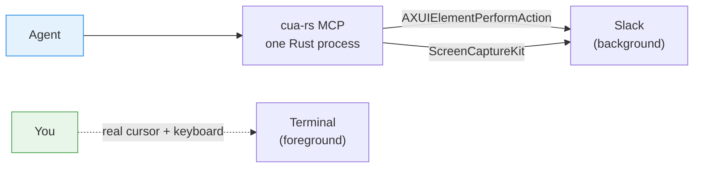

# cua-rs

**Your Mac, driven by an agent. Your cursor, still yours.**

[](https://github.com/maestrojeong/cua-rs-mcp/actions/workflows/ci.yml)
[](https://github.com/maestrojeong/cua-rs-mcp/releases)
[](LICENSE)


cua-rs is a macOS computer-use MCP server that drives native apps through the
**Accessibility API** instead of synthesizing mouse and keyboard input. Nothing
moves your pointer, nothing steals keyboard focus, nothing switches your Space.
An agent can work in a background window while you keep typing in another — on
the same Mac, at the same time. One Rust binary, no Node.js, no Python.



## Why cua-rs?

Almost every computer-use tool for macOS drives the machine by *pretending to be
a human*: warp the cursor with `CGWarpMouseCursorPosition`, then post synthetic
events into the global HID tap with `CGEventPost`. It works — and it is a
shared, single-writer channel. There is exactly one cursor and one keyboard
focus on a Mac, so an agent driving it that way is **competing with the person
sitting at it**.

cua-rs delivers actions *directly to the target UI element* instead.

| | HID-synthesis tools | cua-rs |
|---|:--|:--|
| click | move cursor, post mouse down/up | `AXUIElementPerformAction(AXPress)` |
| type | post key events to whatever has focus | `AXUIElementSetAttributeValue(AXValue)` |
| scroll | post wheel events at a point | `AXScrollDownByPage` |
| screenshot | `CGWindowListCreateImage` (deprecated) | ScreenCaptureKit, per window |
| your cursor | moves | **never touched** |
| your keyboard focus | changes | **never changes** |
| your active Space | can switch | **never switches** |
| occluded / off-Space window | blank or stale capture | **captures correctly** |
| window must be visible / on top | usually | **no** (measured: identical tree background vs frontmost) |
| you working simultaneously | input fights the agent | **works** |

There is exactly **one** line in this repository that posts an HID event, and it
lives in `cua-hid`, which is unreachable unless you start the server with
`--allow-hid`:

```console
$ grep -rn 'CGEvent::post' crates/*/src/*.rs
crates/cua-hid/src/lib.rs:131:  CGEvent::post(CGEventTapLocation::HIDEventTap, Some(&event));

$ cargo tree -p cua-ax -p cua-capture | grep -c cua-hid
0
```

The boundary is enforced by the dependency graph, not by discipline: the crates
that do the actual driving cannot reach the one that can move your pointer. So
the coexistence property is not a tuning choice — it is what the default build
structurally *can* do. See [the one escape hatch](#the-one-escape-hatch).

## Quick start

**1. Install** — macOS arm64 downloads a prebuilt binary.

```bash
curl -fsSL https://raw.githubusercontent.com/maestrojeong/cua-rs-mcp/main/install.sh | sh
cua-rs --help
```

To pin a release instead of following `latest`:

```bash
curl -fsSL https://raw.githubusercontent.com/maestrojeong/cua-rs-mcp/main/install.sh | CUA_VERSION=v0.1.0 sh
```

Or from source:

```bash
cargo install --git https://github.com/maestrojeong/cua-rs-mcp cua-mcp
```

**2. Grant permissions** — two of them, and **they attach to the process that
launches `cua-rs`, not to `cua-rs` itself**. macOS credits the request to the
responsible process, so a grant given to iTerm does not carry over to Claude
Desktop, Cursor, or Codex CLI.

| Grant | Needed for | Without it |
|---|:--|:--|
| Accessibility | reading UI structure, every action | nothing works |
| Screen Recording | window screenshots | tree still works, no images |

```bash
cua-rs permissions      # never prompts
# accessibility:    true
# screen_recording: true
```

System Settings → Privacy & Security → Accessibility (then Screen Recording),
add the **host** app, restart it.

**3. Run** — stdio for a client that launches the server:

```bash
cua-rs
```

**4. Verify** — point an MCP client at it and drive an app:

```text
list_apps                            # find the exact name to pass
get_app_state  → { "app": "Notes" }  # tree + screenshot, assigns [N] handles
click          → { "app": "Notes", "element_index": "12" }
```

The workflow is always: `get_app_state`, act on an index, then re-read when you
need to confirm.

## Connect an MCP client

```json
{
  "mcpServers": {
    "cua": { "command": "cua-rs" }
  }
}
```

Or Streamable HTTP, for a client that connects to an already-running server:

```bash
cua-rs 9331
# streamable HTTP: http://127.0.0.1:9331/mcp
# health:          http://127.0.0.1:9331/health
```

cua-rs refuses to bind anywhere but loopback. It exposes full desktop control
and has no authentication of its own, so a reachable port would hand your
machine to the network.

## How targeting works

`get_app_state` walks one window's accessibility tree and captures it in the
same moment, then numbers everything actionable:

```text
Notes (pid 41277)  snapshot_id=1
window: Groceries
elements: 214 total, 38 actionable

AXWindow "Groceries"
  AXToolbar
    [3] AXButton "New Note"
    [7] AXTextField:SearchField "Search" (editable)
  [12] AXOutline "Notes"
    [13] AXRow "Groceries" (selected)
    [14] AXRow "Reading list"
  [21] AXTextArea = "milk\neggs" (editable, focused)

(96 structural or empty elements omitted)
```

Lines with `[N]` are targetable. Lines without one are context — present so the
model can see structure, but not clickable, which stops it from trying to press
a scroll area. Layout wrappers collapse rather than indent, so `AXGroup` chains
thirty levels deep cost nothing.

```json
{ "app": "Notes", "element_index": "3" }
```

### Stale handles fail loudly

Indices are valid only until the next `get_app_state` for that app. Index 42 in
an old snapshot is a *different element* than index 42 in the current one, so
honoring it silently would click the wrong thing — the one failure mode here
that a retry cannot fix and the user cannot see.

Pass `snapshot_id` to turn that into an error instead of a mis-click:

```json
{ "app": "Notes", "element_index": "42", "snapshot_id": 1 }
```

```text
element_index 42 refers to snapshot 1, but the current snapshot for this app
is 3. Call get_app_state again and use a fresh index.
```

Recommended for anything destructive.

### Ambiguity is reported, never guessed

```text
`notes` is ambiguous: it matches Notes (com.apple.Notes),
Notes Pro (com.other.NotesPro). Use the bundle identifier instead.
```

Silently picking one of two matching apps is how an agent types a message into
the wrong window. App names resolve through six tiers — exact bundle id, exact
name, bundle path basename, bundle-id suffix, name prefix, name substring — and
`Slack` never loses to `Slack Helper (GPU)`.

## Tools

Names match OpenAI's Codex computer-use plugin, which has become the de-facto
vocabulary for this capability on macOS. Models have already seen it; a private
dialect would cost recognition and buy nothing.

| Tool | Purpose |
|---|:--|
| `check_permissions` | grant status; never prompts |
| `list_apps` | running apps, frontmost first |
| `get_app_state` | **call first** — tree + screenshot from one snapshot |
| `click` | activate an element (`AXPress` → `AXPick` → `AXConfirm`) |
| `set_value` | write a text element's value |
| `scroll` | page a scroll area |
| `type_text` | append text, preserving what is there |
| `select_text` | select a substring, with prefix/suffix anchors |
| `press_key` | Return / Escape / arrows via AX; chords need `--allow-hid` |
| `perform_secondary_action` | any AX verb: `AXShowMenu`, `AXRaise`, `AXIncrement` |
| `find` | search the snapshot by text |
| `wait_for` | poll until text appears or disappears |

`get_app_state` knobs: `include_screenshot` (drop it on follow-up calls — it is
the expensive part), `max_image_dim`, `max_elements`, `verbose` (show the
filtered-out containers and frame geometry when a control seems missing),
`skeleton` + `scope_element_id` (below).

### Dense apps: skeleton, then drill in

A Slack or VS Code window can expose thousands of elements. `skeleton=true`
summarizes large deep subtrees instead of expanding them, so the overall map
stays cheap:

```text
[0] AXWindow:StandardWindow "(5) Home • Threads - Chrome"
  AXGroup "(5) Home • Threads - Chrome"
    [5] AXGroup  (+40 elements — pass scope_element_id=5 to expand)
  [2] AXButton:CloseButton
  [3] AXButton:FullScreenButton
  [4] AXButton:MinimizeButton

(skeleton: 40 elements collapsed into their containers; pass
 scope_element_id=N to expand one, or skeleton=false for everything)
```

Then spend the whole element budget inside just that subtree:

```json
{ "app": "Google Chrome", "scope_element_id": "5" }
```

The window and its direct children never collapse — that is the map an agent
orients itself with. Only depth 2 and below, and only subtrees big enough that a
summary line is cheaper than the elements it replaces.

## Known limits

Honest ones, not a roadmap.

| Case | Works? |
|---|:--|
| buttons, menus, checkboxes, tabs, list rows | yes |
| text fields, search fields, text areas | yes |
| Electron apps (Slack, VS Code, Discord) | yes — but the tree builds lazily, so the first read can be nearly empty; call `get_app_state` again |
| Return, Escape, stepper arrows | yes — `AXConfirm` / `AXCancel` / `AXIncrement` |
| arbitrary chords (`⌘⇧P`, `f5`) | only with `--allow-hid`, which moves the cursor |
| canvas apps (Figma internals, games) | **no** — no AX elements to act on |
| terminals | mostly no |
| drag | **no** — macOS AX has no semantic drag |

`set_value` **replaces** rather than appends; `type_text` appends. Apps that only
react to real key events will ignore both.

### The one escape hatch

`press_key` can send a real key event for chords AX cannot express, but only
when the server was started with `--allow-hid`. That path moves the cursor and
takes keyboard focus, so it is off by default and never silent:

```text
delivery: hid  (a real key event: the cursor and keyboard focus were used,
                exactly as if the user pressed the keys)
```

Every action result carries `delivery: ax` or `delivery: hid`, so an agent can
never mistake one for the other. All HID code lives in one crate, `cua-hid`,
which `cua-ax` and `cua-capture` do not depend on — `grep -rl cua_hid crates/`
enumerates every site that can touch your pointer.

`ui_changed: false` in an action result is reported honestly. It does not always
mean failure — some controls change nothing observable — but hiding it would let
an agent believe every dispatched action landed.

## Development

```bash
cargo build --workspace
cargo test --workspace          # 50 tests, no permissions needed
cargo clippy --workspace --all-targets -- -D warnings
```

```text
crates/cua-ax        safe AXUIElement wrapper, budgeted tree walker, AxNode
crates/cua-capture   ScreenCaptureKit per-window PNG + permission preflight
crates/cua-core      app resolution, worker thread, snapshot generations
crates/cua-mcp       rmcp server, binary `cua-rs`
```

Two design constraints worth knowing before touching the code:

**All native work runs on one thread.** `Element` wraps a
`CFRetained<AXUIElement>` and is honestly `!Send` — AX calls are synchronous IPC
into another process's run loop. Instead of `unsafe impl Send` on FFI handles,
`cua-core` funnels every native call onto one long-lived thread and blocks on a
reply channel. It also serializes tool calls by construction.

**Everything is budgeted.** An AX tree can be effectively unbounded
(virtualized 100k-row tables) and is not guaranteed acyclic, so an uncapped walk
is a hang, not a slow path. The walk is breadth-first on purpose: depth-first
burns the whole element budget inside the first sidebar and never reaches the
main content.

CI runs on macOS runners only — every crate links AppKit, ApplicationServices
and ScreenCaptureKit — and has neither grant, so it exercises the
permission-free logic plus an MCP handshake smoke test. Anything touching a live
UI is verified by hand.

### `cua-ax` stands alone

`cua-ax` is publishable on its own, and it is the piece the Rust ecosystem is
actually missing. [`accessibility-sys`](https://crates.io/crates/accessibility-sys)
has not shipped an API change since March 2025 despite ~177k downloads and 11
dependent crates, and every existing Rust project driving macOS UI is either
stuck on it or hand-rolling raw `core-foundation`.
[`objc2-application-services`](https://crates.io/crates/objc2-application-services)
provides modern raw bindings but no safe layer. `cua-ax` is that layer, and it
covers all 29 AX symbols a complete computer-use implementation needs.

## Prior art

cua-rs is not the first Rust MCP server for macOS computer use, and this README
would be dishonest if it implied otherwise.

- [**trycua/cua**](https://github.com/trycua/cua/tree/main/libs/cua-driver) —
  `cua-driver` (MIT) is larger, cross-platform and further along. Its `docs/`
  and `Skills/cua-driver/MACOS.md` are the best free documentation of this
  problem domain that exists. Read them.
- [**lahfir/agent-desktop**](https://github.com/lahfir/agent-desktop) — Rust AX
  engine, headless-by-default, CLI rather than MCP.
- [**minghinmatthewlam/computer-use-mcp**](https://github.com/minghinmatthewlam/computer-use-mcp) —
  same positioning, in Swift.

What this project does differently:

1. **Modern `objc2` stack.** `objc2 0.6` + `objc2-application-services 0.3`
   rather than `core-foundation` / `accessibility-sys`.
2. **A reusable crate, not a monolith.** `cua-ax` ships on its own.
3. **Chromium delegated, not coaxed.** Every AX-only tool degrades on Electron
   and Chromium content. The intended answer here is to hand that to
   [browser-rs](https://github.com/maestrojeong/browser-rs-mcp) over CDP rather
   than fight `AXManualAccessibility` — a composition the sibling servers make
   natural:

   | | |
   |---|:--|
   | [browser-rs](https://github.com/maestrojeong/browser-rs-mcp) | web, over CDP |
   | [bash-rs](https://github.com/maestrojeong/bash-rs-mcp) | shell, backgrounded |
   | **cua-rs** | native macOS apps, over AX |

## License

Apache-2.0
