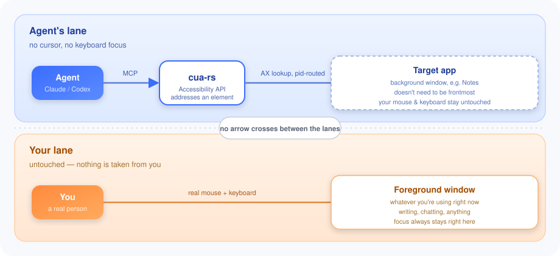

# cua-rs

**AI 에이전트가 당신의 Mac을 대신 조작합니다. 마우스와 키보드는 그대로 당신 것입니다.**

[](https://github.com/maestrojeong/cua-rs-mcp/actions/workflows/ci.yml)
[](https://github.com/maestrojeong/cua-rs-mcp/releases)
[](LICENSE)


## 이게 뭔가요?

`cua-rs`는 AI 에이전트(예: Claude, Codex 등)가 macOS의 실제 앱을 직접 조작할 수 있게 해주는
**MCP 서버**입니다. "컴퓨터를 쓰는 AI 에이전트"를 만들 때 흔히 쓰는 방식은 화면 좌표를 계산해서
마우스를 움직이고 클릭하는 것인데, 이 방식은 여러분이 지금 쓰고 있는 마우스/키보드/화면을
그대로 빼앗아 버립니다.

`cua-rs`는 macOS의 **접근성(Accessibility) API**로 화면의 좌표가 아니라 "저 버튼",
"이 텍스트 필드" 같은 **요소 자체**를 찾습니다. 텍스트 값과 명시적인 AX 동작은 요소에
직접 전달하고, 기본 `click`/`press_key`는 `cua-hid`가 만든 합성 이벤트를 SkyLight를 통해
대상 프로세스에만 전달합니다. 공유 HID 스트림에는 쓰지 않지만 키 입력은 그 프로세스에서
현재 포커스된 요소에 도착하므로, 결과에 포커스 검증 상태를 함께 보고합니다. 그 덕분에:

- 당신의 마우스 커서는 움직이지 않습니다.
- 다른 앱으로 키 입력을 보내거나 활성 앱을 전환하지 않습니다.
- 다른 데스크톱(Space)으로 전환하지도 않습니다.

즉, 당신이 문서를 쓰는 동안 에이전트는 백그라운드에 있는 다른 앱(메모, 메신저 등)을
조용히 조작할 수 있습니다. 하나의 Rust 바이너리로 동작합니다.

<p align="center"></p>

두 영역 사이에는 화살표가 없습니다. 그게 이 프로젝트의 핵심입니다. 실제 커서를 움직이지
않고, 공용 키보드 입력 스트림에 끼어들지 않고, 창을 앞으로 끌어오지 않습니다. 다만
프로세스 단위 키 입력은 AX 요소 자체가 아니라 그 앱의 첫 번째 응답자(first responder)로
전달된다는 제한이 있습니다. 더 자세한 설계 배경은 [DESIGN.md](DESIGN.md)에 있습니다.

## 설치

```bash
curl -fsSL https://raw.githubusercontent.com/maestrojeong/cua-rs-mcp/main/install.sh | sh
cua-rs --help
```

특정 버전을 쓰려면 `CUA_VERSION=v0.4.2`, 소스에서 직접 빌드하려면 두 바이너리가 같은
Cargo bin 디렉터리에 설치되도록 다음을 실행합니다.

```bash
cargo install --git https://github.com/maestrojeong/cua-rs-mcp cua-mcp cua-overlay
```

> Releases 페이지에서 바이너리를 직접 내려받았다면, macOS의 격리(quarantine) 표시 때문에
> 실행이 멈출 수 있습니다. `xattr -d com.apple.quarantine ./cua-rs`로 해제하세요.
> (위 설치 스크립트는 이 과정을 자동으로 해줍니다.)

## 권한 허용하기

두 가지 권한만 필요합니다. **중요한 점은, 이 권한이 `cua-rs`를 실행시킨 앱(예: Claude
Desktop, Cursor)에 부여된다는 것입니다.** 즉 다른 터미널에서 실행하면 다시 권한을 허용해야
하지만, `cua-rs`를 업그레이드해도 다시 허용할 필요는 없습니다.

| 권한 | 어디에 필요한가 | 없으면 |
|---|:--|:--|
| 접근성(Accessibility) | 화면 구조 읽기, 모든 동작 | 아무것도 동작하지 않음 |
| 화면 기록(Screen Recording) | 스크린샷, 클릭 직전 안전 확인 | 화면 구조 읽기와 조작은 되지만 이미지는 못 받음 |

```bash
cua-rs permissions      # 권한을 요청하지 않고 상태만 확인
```

macOS의 **시스템 설정 → 개인정보 보호 및 보안 → 손쉬운 사용**(그다음 화면 기록)에서,
`cua-rs`를 실행하는 앱을 추가하고 그 앱을 재시작하세요.

참고로 `cua-rs`는 시스템 설정 자체, 키체인 접근, 비밀번호 관리자 등에는 **조작을 거부**합니다
(읽는 것은 가능합니다). 자세한 내용은 [안전 장치](#안전-장치) 섹션 참고.

## 연결하기

```json
{ "mcpServers": { "cua": { "command": "cua-rs" } } }
```

이미 실행 중인 서버에 연결하고 싶다면 Streamable HTTP 모드도 지원합니다:

```bash
cua-rs 9331     # http://127.0.0.1:9331/mcp
```

이 모드는 로컬 컴퓨터 안에서만 접속되며, 매번 임의로 생성되는 토큰(또는
`CUA_HTTP_TOKEN`으로 직접 지정한 토큰)으로 보호됩니다. stdio 모드(위의 기본 연결 방식)는
클라이언트가 프로세스를 직접 실행하므로 토큰이 필요 없습니다.

## 안전 장치

에이전트가 실수로 위험한 일을 하지 않도록 여러 안전 장치가 기본으로 켜져 있습니다.
막힌 동작이 있으면 "왜 막혔는지, 어떻게 풀 수 있는지"를 항상 함께 알려줍니다.

- **조작 가능한 앱을 제한할 수 있습니다.** `CUA_ALLOWED_APPS`를 설정하면 지정한 앱 외에는
  조작(읽기는 제외)이 모두 거부됩니다. 가장 안전한 사용법으로 권장합니다.
- **비밀번호/보안 관련 앱은 절대 조작하지 않습니다.** 키체인 접근, 비밀번호 앱, 1Password,
  Bitwarden, 시스템 설정, 로그인/잠금 화면 등. 읽기는 가능하지만 스크린샷은 제공하지 않습니다.
- **삭제 같은 위험한 동작에는 확인이 필요합니다.** 버튼 이름이 "삭제", "제거", "초기화" 등으로
  읽히면 한 번 더 확인(`confirm_destructive: true`)해야 실행됩니다. 대화상자에서 엔터 키를
  누르는 것, "확인" 버튼을 누르는 것도 이 규칙에 포함됩니다. 반대로 "취소", "저장"처럼 되돌리는
  동작은 항상 허용됩니다.
- **잠긴 화면이나 화면 보호기 상태에서는 아무 동작도 전달되지 않습니다.**
- **원하면 사람이 쓰고 있는 앱은 건드리지 않게 할 수도 있습니다** (`CUA_YIELD_TO_HUMAN=1`,
  기본은 꺼져 있음). 켜면 사람이 그 창을 쓰는 동안 에이전트가 양보합니다.

이 안전 장치들은 "혹시 위험할 수도 있으면 일단 막고 물어본다" 전략을 씁니다. 가장 확실한
안전 장치는 `CUA_ALLOWED_APPS`로 조작 가능한 앱 자체를 제한하는 것입니다 — 한번 설정하면
에이전트 스스로는 그 범위를 넓힐 수 없습니다. 판단 기준의 세부 사항은
[DESIGN.md §7a](DESIGN.md)에 정리되어 있습니다.

## 사용하는 방법 (에이전트 관점)

에이전트는 먼저 `get_app_state`로 현재 창의 상태(화면에 뭐가 있는지)를 받아옵니다.

```text
Notes (pid 41277)  snapshot_id=1
  AXWindow "Groceries"
    [3] AXButton "New Note"
    [7] AXTextField:SearchField "Search" (editable)
  [21] AXTextArea = "milk\neggs" (editable, focused)
```

여기서 번호가 붙은 요소(`[3]`, `[7]`, `[21]`)를 골라서 클릭하거나 값을 입력할 수 있습니다.

| 도구 | 설명 |
|---|:--|
| `get_app_state` | 먼저 호출 — 화면 구조와 스크린샷을 한 번에 가져옵니다 |
| `find` / `wait_for` | 특정 텍스트가 나타나거나 사라질 때까지 찾습니다 |
| `click` / `drag` / `hover` | 요소를 클릭·드래그·마우스오버합니다 |
| `set_value` / `type_text` / `select_text` | 텍스트를 쓰거나, 추가하거나, 선택합니다 |
| `press_key` | 키보드 키나 단축키를 누릅니다 |
| `menu_bar` | 메뉴바를 읽고 메뉴 항목을 클릭합니다 |
| `scroll` | 스크롤합니다 |
| `list_apps` / `check_permissions` | 실행 중인 앱 목록과 권한 상태를 확인합니다 |

모든 동작은 실행 후 화면이 어떻게 바뀌었는지 결과로 돌려줘서, 에이전트가 한 번의 요청으로
"실행하고 확인하기"를 같이 할 수 있습니다.

## 할 수 있는 것 / 할 수 없는 것 (요약)

- 버튼, 메뉴, 탭, 목록, 텍스트 필드 클릭·입력: 대부분의 네이티브 앱과 Electron 앱에서 잘 동작합니다.
- 클릭으로 열리는 팝업 메뉴: 항목을 직접 클릭하는 것은 지원하지 않고, 키보드 단축키나
  메뉴바를 통해 선택해야 합니다 (팝업 메뉴는 접근성 API로 볼 수 없는 특수한 창이라서 그렇습니다).
- 마우스 오버(hover) 효과: 웹 페이지(Chrome, Safari)에서는 잘 동작하지만, Finder 같은
  네이티브 목록에서는 동작하지 않습니다.
- 접근성 API에 스크롤 기능이 없는 화면(캔버스, 일부 Electron 목록): 스크롤 대신 페이지
  업/다운 키를 사용하도록 안내합니다.
- Chrome/Safari가 화면 맨 앞에 있지 않을 때(백그라운드 상태)는 클릭·마우스오버가 전혀
  전달되지 않습니다. 웹 페이지를 다뤄야 한다면 이 프로젝트보다
  [browser-rs](https://github.com/maestrojeong/browser-rs-mcp)(CDP 기반)가 더 적합합니다.
- 터미널 앱: 읽기는 가능하고, 입력은 `mechanism: "keystrokes"` 옵션을 쓰면 됩니다.

더 자세한 실험 결과와 수치는 [DESIGN.md](DESIGN.md)에 정리되어 있습니다.

## 화면에 그려지는 커서

접근성 API로 조작하면 화면에 아무 흔적도 남지 않아서, 에이전트가 뭘 하는지 눈으로 보기
어렵습니다. 그래서 `cua-overlay`라는 별도의 작은 프로그램이 함께 설치되어, 에이전트가
조작하는 위치에 **클릭할 수 없는 투명한 화살표**를 그려줍니다. 이 화살표는 진짜 커서가
아니고, 마우스 입력을 가로채지도 않습니다. 조작 중인 앱이 화면 맨 앞에 있을 때만 보이고,
아니면 숨겨집니다.

`cua-rs`는 정규화된 자기 실행 파일과 같은 디렉터리에서 정확히 `cua-overlay`라는 이름을
찾습니다. 없거나 실행할 수 없으면 동작 자체는 계속하지만 stderr에 한 번 경고하고 화면의
조작 위치 표시는 비활성화됩니다. 위 설치 스크립트와 소스 설치 명령은 둘을 함께 설치합니다.

<p align="center"></p>

## 개발자용

```bash
cargo build --workspace
cargo test --workspace          # 249개 테스트, 별도 권한 필요 없음
cargo clippy --workspace --all-targets -- -D warnings
```

프로젝트는 역할별로 여러 크레이트(패키지)로 나뉘어 있습니다:

```text
cua-ax        macOS 접근성(AXUIElement) API를 안전하게 감싸는 계층
cua-capture   창을 찾고 스크린샷을 찍는 계층
cua-core      스냅샷, 앱 탐색, 안전 장치 등 핵심 로직
cua-hid       실제 클릭/키 입력을 프로세스 단위로 전달하는 계층
cua-mcp       MCP 서버 본체, 실행 파일 `cua-rs`
cua-overlay   화면에 그려지는 커서
```

더 깊은 설계 이유와 제약 사항은 [DESIGN.md](DESIGN.md)에 있습니다.

## 비슷한 프로젝트

- [**trycua/cua**](https://github.com/trycua/cua/tree/main/libs/cua-driver) — 더 크고, 여러
  플랫폼을 지원하며, 더 앞서 있는 프로젝트. 이 분야에 대한 좋은 글도 많습니다.
- [**lahfir/agent-desktop**](https://github.com/lahfir/agent-desktop) — Rust로 만든 접근성 엔진,
  MCP가 아니라 CLI 형태.
- [**minghinmatthewlam/computer-use-mcp**](https://github.com/minghinmatthewlam/computer-use-mcp) —
  비슷한 목표를 Swift로 구현.

## 라이선스

Apache-2.0
