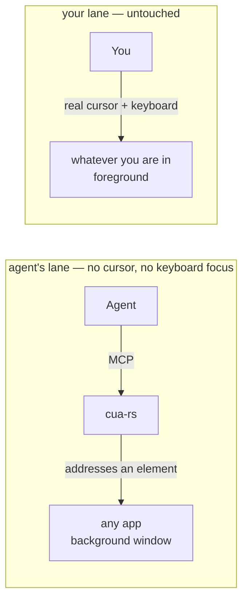

# cua-rs

**Your Mac, driven by an agent. Your cursor stays yours.**

[](https://github.com/maestrojeong/cua-rs-mcp/actions/workflows/ci.yml)
[](https://github.com/maestrojeong/cua-rs-mcp/releases)
[](LICENSE)


A macOS computer-use MCP server that drives native apps through the
**Accessibility API** — addressing a UI element instead of moving a pointer to a
coordinate. Nothing moves your cursor, takes your keyboard focus, or switches
your Space, so an agent can work in a background window while you keep typing in
another. One Rust binary.



There is no arrow between the lanes, and that is the whole product. What it
will not do is the point: no flag warps the pointer, posts to the shared
keyboard stream, or raises a window. [DESIGN.md](DESIGN.md) covers what that
costs.

## Install

```bash
curl -fsSL https://raw.githubusercontent.com/maestrojeong/cua-rs-mcp/main/install.sh | sh
cua-rs --help
```

Pin a release with `CUA_VERSION=v0.4.2`, or build from source with
`cargo install --git https://github.com/maestrojeong/cua-rs-mcp cua-mcp`.

> Downloading the binary by hand from the Releases page? Clear the quarantine
> flag or it hangs instead of erroring: `xattr -d com.apple.quarantine ./cua-rs`.
> The installer above does this for you.

## Grant permissions

Two grants, and **they attach to the process that launches `cua-rs`, not to
`cua-rs` itself** — so a grant given to iTerm does not carry to Claude Desktop,
Cursor, or Codex CLI, and a `cua-rs` upgrade never costs a re-approval.

| Grant | Needed for | Without it |
|---|:--|:--|
| Accessibility | reading UI structure, every action | nothing works |
| Screen Recording | screenshots, last-moment window validation for process-routed clicks | tree and AX actions still work; no images |

```bash
cua-rs permissions      # never prompts
```

System Settings → Privacy & Security → Accessibility (then Screen Recording),
add the **host** app, restart it.

Note that cua-rs refuses to *act* on System Settings itself, along with Keychain
Access and password managers — see [Safety](#safety). Reading them still works.

## Connect

```json
{ "mcpServers": { "cua": { "command": "cua-rs" } } }
```

Or Streamable HTTP for a client that attaches to an already-running server:

```bash
cua-rs 9331     # http://127.0.0.1:9331/mcp  ·  /health
```

Loopback only, always — and loopback is not an authorization boundary, so `/mcp`
also requires a bearer token. Set `CUA_HTTP_TOKEN` to pin one, or let the server
generate one and print it on stderr at startup:

```text
INFO cua_mcp: generated a bearer token for this run. Clients must send
              `Authorization: Bearer 9f3c…` to /mcp. Set CUA_HTTP_TOKEN to pin your own.
```

`/health` stays open, so a supervisor can probe a server it has no credential
for. stdio mode needs no token: the client already owns the process.

## Safety

Five gates. Each refusal names what to pass or change, so an agent can resolve
it in one round trip. [DESIGN.md §7a](DESIGN.md) has the reasoning.

| | default | how to change it |
|---|:--|:--|
| **Credential and security apps are never driven.** Keychain Access, the Passwords app, 1Password / Bitwarden / LastPass / Dashlane / KeePass and friends, System Settings, login and unlock prompts. Matched on bundle identifier, not display name. | on | `CUA_ALLOW_FORBIDDEN_TARGETS=1` |
| **Reading them is still allowed** — `get_app_state`, `find`, `list_apps` — because a blocked app you cannot even look at is one you cannot explain. The screenshot is withheld, though: pixels reproduce the secret rather than describing it. | on | same flag |
| **Destructive controls need confirming.** A target whose label reads as Delete / Remove / Erase / Reset / Move to Trash / Don't Save / 삭제 / 제거 / 초기화 / 나가기 is refused, as is `cmd+delete` and a bare `delete` outside a text field. | on | pass `confirm_destructive: true` on that call |
| **Nothing is delivered to a locked screen** or one running its screen saver. Reads continue. | on | — |
| **Yield to the human.** When enabled, cua-rs stops acting on an app while the human is using it, rather than fighting them for the window. Uses a listen-only event tap that returns every event unchanged — it reads the input stream and never writes to it. | **off** | `CUA_YIELD_TO_HUMAN=1`, `CUA_YIELD_IDLE_MS` (default 3000) |

The label classifier deliberately over-reports: a false positive costs one extra
call, a false negative costs a deleted conversation. If a refusal looks wrong,
confirming is the right answer.

## Use

`get_app_state` first, always: it walks one window, captures it in the same
moment, and numbers everything actionable. Those numbers are what actions take.

```text
Notes (pid 41277)  snapshot_id=1
  AXWindow "Groceries"
    [3] AXButton "New Note"
    [7] AXTextField:SearchField "Search" (editable)
  [21] AXTextArea = "milk\neggs" (editable, focused)
```

```json
{ "app": "Notes", "element_token": "1-3-AXButton" }
```

Lines with `[N]` are targetable; the rest is context. `element_token` bundles
the snapshot, index and role, so acting on a stale handle errors instead of
mis-clicking. `x`/`y` also works, resolved against the snapshot's geometry.

| Tool | |
|---|:--|
| `get_app_state` | **call first** — tree + screenshot from one snapshot |
| `find` · `wait_for` | search the snapshot; poll until text appears or goes |
| `click` | a pid-routed event; no `AXPress`/`AXPick`/`AXConfirm` attempt; `confirm_destructive` for a Delete-shaped target |
| `click_in_window` | last resort: a bare point, no element, nothing verified |
| `set_value` · `type_text` · `select_text` | write, append, select a substring — a single AX call |
| `press_key` | any key or chord (`⌘⇧P`, `ctrl+alt+delete`, …), pid-routed |
| `scroll` · `perform_secondary_action` | page a scroll area; any AX verb |
| `list_apps` · `check_permissions` | running apps; grant status |

Actions re-read the window and return a delta by default, so acting and looking
cost one round trip instead of two. Read it as a textual delta, not as proof —
to know one element's state, read that element. For a dense app, `skeleton: true`
summarizes big subtrees, then `scope_element_id` spends the whole budget inside
one of them.

## Limits

| | |
|---|:--|
| buttons, menus, tabs, rows, text fields, Electron apps | yes (Electron: the tree builds lazily, so read twice) |
| any key or chord | yes, pid-routed |
| drag | **no** — no AX verb, and the pid tier has no drag primitive yet |
| canvas apps, games | clickable, but you supply the coordinate and the confidence |
| terminals | reading yes; typing no — `set_value`/`type_text` write `AXValue`, which terminals ignore; `press_key` reaches them but one key or chord at a time |

`set_value` replaces and `type_text` appends via one atomic `AXValue` write; an
app that only reacts to real key events ignores both. `click` and `press_key`
never attempt an AX action at all — every event is routed to the target process
by pid, reported as `delivery: pid`, and fails rather than touching your pointer
if that tier is unavailable.

## The drawn cursor

The AX path leaves nothing on screen — which also means you cannot see the agent
working. `cua-overlay` is a separate binary that draws a click-through arrow where
an action landed, never focused, never your real cursor. `cua-rs` spawns it if it
sits next to the binary; **the prebuilt release ships `cua-rs` alone**, so build
the workspace to get both.

<p align="center"></p>

## Development

```bash
cargo build --workspace
cargo test --workspace          # 149 tests, no permissions needed
cargo clippy --workspace --all-targets -- -D warnings
```

```text
cua-ax        safe AXUIElement wrapper + budgeted tree walker
cua-capture   window discovery + crash-isolated per-window PNG
cua-core      app resolution, one native worker thread, snapshots, safety gates
cua-hid       process-routed input — the only crate that synthesizes events
cua-mcp       the server, binary `cua-rs`
cua-overlay   the drawn cursor
```

Two constraints worth knowing before touching it: every native call runs on one
thread, because `AXUIElement` handles are honestly `!Send`; and every tree walk
is budgeted, because an AX tree can be unbounded and is not guaranteed acyclic.
[DESIGN.md](DESIGN.md) has the reasoning, the measurements, and the known weak
spots.

## Prior art

- [**trycua/cua**](https://github.com/trycua/cua/tree/main/libs/cua-driver) — larger, cross-platform, further along; its docs are the best free writing on this domain.
- [**lahfir/agent-desktop**](https://github.com/lahfir/agent-desktop) — Rust AX engine, CLI rather than MCP.
- [**minghinmatthewlam/computer-use-mcp**](https://github.com/minghinmatthewlam/computer-use-mcp) — same positioning, in Swift.

Chromium content degrades under any AX-only tool; hand the web to
[browser-rs](https://github.com/maestrojeong/browser-rs-mcp) over CDP instead.

## License

Apache-2.0
