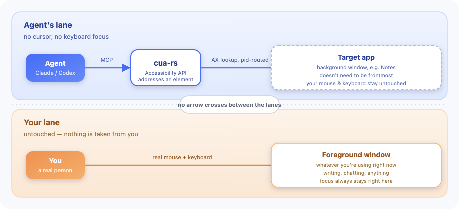

# cua-rs

**An AI agent drives your Mac. Your mouse and keyboard stay yours.**

[](https://github.com/maestrojeong/cua-rs-mcp/actions/workflows/ci.yml)
[](https://github.com/maestrojeong/cua-rs-mcp/releases)
[](LICENSE)


## What is this?

`cua-rs` is an **MCP server** that lets an AI agent (Claude, Codex, etc.)
drive real macOS apps — without taking over the mouse, keyboard or screen
you're currently using.

Most "computer-using agent" tools work by moving the mouse to screen
coordinates and clicking. `cua-rs` instead uses macOS's **Accessibility
API** to address "that button" or "this text field" directly as an element,
and delivers clicks/keys to the target app's process only. So:

- Your mouse cursor never moves.
- Your active app and keyboard focus never change.
- No Space (virtual desktop) switch.

While you're writing a document, the agent can quietly drive some other app
(Notes, a messenger, etc.) in the background. Single Rust binary.

<p align="center"></p>

No arrow crosses between the two lanes — that's the whole point. One caveat:
a key event still lands on the target app's currently focused element, not
necessarily the exact one you named. See [DESIGN.md](DESIGN.md) for the full
rationale.

## Install

```bash
curl -fsSL https://raw.githubusercontent.com/maestrojeong/cua-rs-mcp/main/install.sh | sh
cua-rs --help
```

Pin a version with `CUA_VERSION=v0.4.2`, or build from source (installs both
binaries together):

```bash
cargo install --git https://github.com/maestrojeong/cua-rs-mcp cua-mcp cua-overlay
```

> Downloaded a binary by hand? Clear the quarantine flag first:
> `xattr -d com.apple.quarantine ./cua-rs` (the install script does this
> automatically).

## Permissions

Two grants, given to whatever app **launches** `cua-rs` (e.g. Claude
Desktop) — upgrading `cua-rs` never needs re-approval.

| Permission | Needed for | Without it |
|---|:--|:--|
| Accessibility | reading the screen, every action | nothing works |
| Screen Recording | screenshots, click-safety checks | still works, no images |

```bash
cua-rs permissions      # checks status, never prompts
```

Add the app that runs `cua-rs` under **System Settings → Privacy & Security
→ Accessibility** (then Screen Recording), and restart it.

`cua-rs` **refuses to act** on System Settings, Keychain Access, password
managers, etc. — reading them is still fine. See [Safety](#safety).

## Connect

```json
{ "mcpServers": { "cua": { "command": "cua-rs" } } }
```

Or Streamable HTTP, for attaching to an already-running server:

```bash
cua-rs 9331     # http://127.0.0.1:9331/mcp
```

Local connections only, protected by a bearer token (random by default, or
pin one with `CUA_HTTP_TOKEN`). stdio needs no token.

## Safety

Several gates are on by default; a blocked action always explains why and
how to unblock it.

- **Scope which apps can be driven** — `CUA_ALLOWED_APPS`. Recommended.
- **Credential/security apps are never driven** (Keychain, password
  managers, System Settings, lock screens). Reading still works.
- **Destructive actions need confirming** — buttons like "Delete", "Erase",
  "Reset" require `confirm_destructive: true`. "Cancel"/"Save" are always
  allowed.
- **Nothing reaches a locked screen or screensaver.**
- **Optional: yield to a human actively using the app** —
  `CUA_YIELD_TO_HUMAN=1` (off by default).

`CUA_ALLOWED_APPS` is the strongest guarantee: once set, the agent can never
widen it itself. Full criteria in [DESIGN.md §7a](DESIGN.md).

## How agents use it

Start with `get_app_state` to see what's on screen:

```text
Notes (pid 41277)  snapshot_id=1
  AXWindow "Groceries"
    [3] AXButton "New Note"
    [7] AXTextField:SearchField "Search" (editable)
  [21] AXTextArea = "milk\neggs" (editable, focused)
```

Numbered elements (`[3]`, `[7]`, `[21]`) can be clicked or filled in.

| Tool | What it does |
|---|:--|
| `get_app_state` | call first — tree + screenshot together |
| `find` / `wait_for` | look for text to appear/disappear |
| `click` / `drag` / `hover` | act on an element |
| `set_value` / `type_text` / `select_text` | write, append, or select text |
| `press_key` | press a key or shortcut |
| `menu_bar` | read the menu bar and click an item |
| `scroll` | scroll a view |
| `list_apps` / `check_permissions` | list apps; check permission status |

Every action returns what changed, so acting and verifying take one round trip.

## What works, what doesn't

- Buttons, menus, tabs, lists, text fields — works well, native and Electron.
- Pop-up menus from a click — use the item's keyboard shortcut or the menu
  bar instead of clicking inside the pop-up.
- Hover — works on web pages, not on native lists like Finder's.
- Scroll with no Accessibility scroll action (canvas, some Electron lists)
  — falls back to a page-up/down suggestion instead of faking it.
- Chrome/Safari in the background reject clicks and hover entirely. For web
  automation, use [browser-rs](https://github.com/maestrojeong/browser-rs-mcp)
  (CDP-based) instead.
- Terminals — reading works; typing needs `mechanism: "keystrokes"`.

Full experiment notes in [DESIGN.md](DESIGN.md).

## The on-screen cursor

The Accessibility path leaves no visible trace, so a companion binary,
`cua-overlay`, draws a **click-through, transparent arrow** wherever the
agent acts. Not a real cursor, never intercepts input, only visible while
the driven app is frontmost.

`cua-rs` looks for `cua-overlay` next to its own binary; if missing, it logs
one warning and keeps working without the indicator. The installer and the
`cargo install` command above install both together.

<p align="center"></p>

## For developers

```bash
cargo build --workspace
cargo test --workspace          # 249 tests, no special permissions needed
cargo clippy --workspace --all-targets -- -D warnings
```

```text
cua-ax        safe wrapper over the macOS Accessibility (AXUIElement) API
cua-capture   finds windows, takes screenshots
cua-core      snapshots, app resolution, safety gates
cua-hid       delivers clicks/keys to a specific process
cua-mcp       the MCP server itself, binary `cua-rs`
cua-overlay   the on-screen cursor
```

Design rationale and constraints: [DESIGN.md](DESIGN.md).

## Related projects

- [**trycua/cua**](https://github.com/trycua/cua/tree/main/libs/cua-driver) — bigger, cross-platform, further along.
- [**lahfir/agent-desktop**](https://github.com/lahfir/agent-desktop) — Rust accessibility engine, CLI rather than MCP.
- [**minghinmatthewlam/computer-use-mcp**](https://github.com/minghinmatthewlam/computer-use-mcp) — same idea, in Swift.

## License

Apache-2.0
